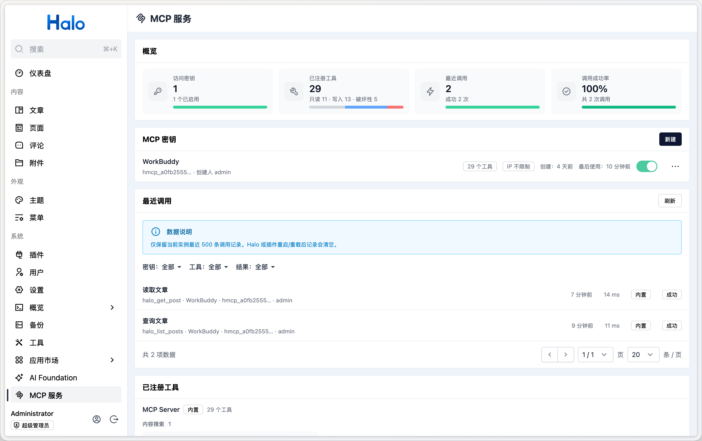

# Halo MCP Server

Halo 的 [Model Context Protocol（MCP）](https://modelcontextprotocol.io/) 服务端插件，
让 Codex、Claude Code、Cursor、VS Code 等 AI 客户端通过受控的访问密钥管理 Halo 网站。



## 功能特性

- 搜索、读取、创建、更新、发布、回收和恢复文章及独立页面
- 查询和管理文章分类、标签、评论及评论回复
- 查询、上传和删除附件；上传沿用 Halo 系统设置中的 Console 附件策略与分组
- 按访问密钥选择可用工具，并支持有效期、禁用、轮换和 IP 白名单
- 在 Halo 控制台查看工具来源和最近调用记录
- 自动发现其他 Halo 插件贡献的 MCP 工具

## 使用要求

- Halo 2.26.0 或更高版本
- 生产环境使用 HTTPS
- 支持 Streamable HTTP 和自定义 Bearer Token 的 MCP 客户端

## 快速开始

1. 在 Halo 控制台中安装并启用 MCP Server 插件。
2. 打开「工具 → MCP 服务」。
3. 创建访问密钥，并选择该密钥可以调用的工具。
4. 复制页面提供的客户端配置，并按提示通过环境变量或安全输入保存密钥。

MCP 端点为：

```text
https://halo.example.com/mcp
```

访问密钥只会在创建或轮换后显示一次。新安装的工具默认不会加入已有密钥，需要管理员手动
选择。MCP 服务管理入口仅对 Halo 超级管理员开放。

## 客户端配置

先在客户端进程的环境变量中设置密钥：

```bash
export HALO_MCP_TOKEN='hmcp_replace_me'
```

### Codex

将以下配置加入 `~/.codex/config.toml`，或可信项目中的 `.codex/config.toml`：

```toml
[mcp_servers.halo]
url = "https://halo.example.com/mcp"
bearer_token_env_var = "HALO_MCP_TOKEN"
```

其他选项参阅 [Codex 官方 MCP 文档](https://developers.openai.com/codex/mcp/)。

### Claude Code

在项目级 `.mcp.json` 中通过环境变量读取密钥：

```json
{
    "mcpServers": {
        "halo": {
            "type": "http",
            "url": "https://halo.example.com/mcp",
            "headers": {
                "Authorization": "Bearer ${HALO_MCP_TOKEN}"
            }
        }
    }
}
```

其他选项参阅 [Claude Code 官方 MCP 文档](https://code.claude.com/docs/en/mcp)。

### MCP Inspector

Inspector 支持临时指定 Streamable HTTP 端点和 Bearer 请求头：

```bash
npx @modelcontextprotocol/inspector \
  --server-url https://halo.example.com/mcp \
  --transport http \
  --header "Authorization: Bearer ${HALO_MCP_TOKEN}"
```

Inspector 的协议版本请选择 `legacy` 或 `auto`。

## 安全提醒

- 为每个客户端创建专用的最小权限密钥，不要把密钥提交到版本库或写入日志。
- IP 白名单是附加防护，不能替代 HTTPS 和最小权限的工具授权。
- Halo 位于反向代理之后时，只信任由可信代理写入的 `Forwarded` 和 `X-Forwarded-*` 请求头，并阻止客户端绕过代理直接访问 Halo。
- 默认不允许携带 `Origin` 请求头的浏览器直连请求，请使用 MCP 客户端或 Inspector。

## 插件开发

其他 Halo 插件可以通过协议无关的 API 贡献 MCP 工具，接入方式参阅
[插件工具 Provider 接入指南](./dev/dev.md)。

## 许可证

[GPL-3.0](./LICENSE) © Halo
